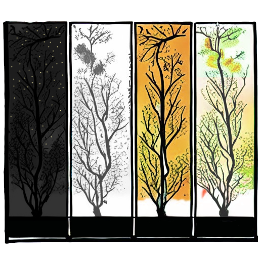

# HDV-Daylight

<blockquote>
    

        ‘‘ What people should do at night is sleep, not work.
    

    

        tatiuo the fishing enthusiast ( 1992 - )
    

</blockquote>
 

## Summary
Daylight is a library for bringing light and darkness like the phases of the sun. Maybe it is usually used to apply the rule of nature that morning is light and night is dark to web pages.
